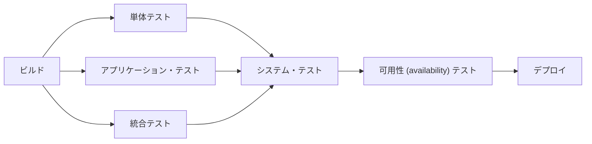

| hoge | hoge | hoge |
| ---- | ---- | ---- |
| fuga | fuga | fuga |

```mermaid
graph LR
    A[ビルド] --> B[単体テスト]
    A --> C[アプリケーション・テスト]
    A --> D[統合テスト]
    B --> E[システム・テスト]
    C --> E
    D --> E
    E --> F["可用性 (availability) テスト"]
    F --> G[デプロイ]
```
