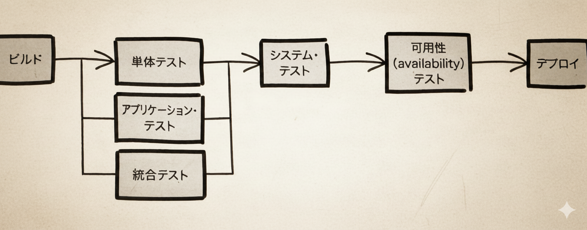

<!---
_class: title
--->

<style>

/* @theme custom */
@import "default";
@import url("https://fonts.googleapis.com/css2?family=Noto+Sans+JP:wght@300;400;600;700;900&display=swap");

:root {
  --accent: #5e80ad;
  --accent-strong: #4488cc;
  --bg-light: #f9fbfd;
  --muted: #656d76;
}

section {
  color: var(--muted);
  font-family: "Noto Sans JP", sans-serif;
  font-size: 20px;
  line-height: 1.7;
  padding-bottom: 1em;
}

strong {
  color: var(--accent-strong);
}

em {
  font-style: normal;
  font-weight: bold;
  background-color: #4488cc25;
  padding: 0.1em 0.3em;
  border-radius: 6px;
}

h1,
h2 {
  color: #224466;
  font-weight: 700;
  letter-spacing: -0.01em;
}

section mjx-container {
  color: var(--accent);
}


section table {
  margin: 10px auto;
  border-collapse: collapse;
  overflow: hidden;
  border-radius: 8px;
}

section table th,
section table td {
  border: 1px solid #d0d7de;
  padding: 0.5em 0.8em;
}

section table th {
  background-color: #eef4fa;
  color: #224466;
  font-weight: 600;
}

section table td {
  text-align: center;
  background: #fff;
}

section table td img {
  display: block;
  margin: 0 auto;
}

section.title,section.chapter {
  text-align: center;
}

header {
  width: 95%;
  padding: 10px;
  font-size: 1.3em;
  font-weight: bold;
  border-bottom: 2px solid var(--accent);
  margin-bottom: 0.6em;
}

</style>

# 読書会第 8 回

## セキュリティを意識したデリバリ・パイプライン

<br>
<br>
前田 統真

---

<!-- _header: この発表の流れ -->

# 1.デリバリパイプラインの利用

# 2.設計をより安全なものにする単体テスト

# 3.機能トグルのテスト

# 4.セキュリティに関するテストの作成と自動化

# 5.可用性のテスト

# 6.設定の妥当性確認

# 7.まとめ

---

<!-- _header: はじめに -->

# 本章の主旨

- **現状の課題**

  - テストの自動化は一般的になったがセキュリティテストは後付けになりがち
  - 開発プロセスと分断されている

- **あるべき姿**
  - セキュリティテストを通常のテストプロセスに統合
  - 開発初期から継続的なセキュリティ検証
  - CI/CD パイプラインの一部として自動化

_セキュリティは開発段階から必要な要素であり、後付けの対策ではない_

---

<!-- _class: chapter -->

# デリバリパイプラインの利用

---

<!-- _header: 1.デリバリパイプラインの利用 -->

# デリバリパイプラインとは

ソフトウェアを本番環境などに展開するまでのプロセスを自動化したもの

- メリット
  - 変更ごとの一貫した検証
  - デプロイ前の不正動作検出



---

<!-- _header: 1.デリバリパイプラインの利用 -->

### ビルド、テスト、デプロイの自動実行する中にセキュリティテストを組み込むことでソフトウェアの安全性について速やかにフィードバックが得られる

**これの何が嬉しいか**

- 発見の遅くなると変更量が増大するので早く少なく修正することで済む
  - リリース前テスト方式だと、テスト期間中に致命的な問題が出た場合、リリース日程を遅らせて対応することになりやすい。早期に問題を潰しておく方式にすれば、リリース直前段階での不確実性を減らしやすい
- 開発プロセスの中でセキュリティを守るようにする意識が育ち、脆弱性を「作らない」設計が促される

---

<!-- _class: chapter -->

# 設計をより安全なものにする単体テスト

---

<!-- _header: 2.設計をより安全なものにする単体テスト -->

# **4 種類**のテストアプローチ

| テストの種類 | 目的                                                                                                       |
| ------------ | ---------------------------------------------------------------------------------------------------------- |
| 正常値       | 想定される通常の値<br>正しく振る舞うことを確認                                                             |
| 境界値       | 許容範囲内の境界で不変条件やドメインルールによって意味が変わる境界も含まれる値<br>正しく振る舞うことを確認 |
| 異常値       | 有効でない値で null や空のデータなど<br>設計が破綻しないことを確認                                         |
| 極端値       | 極端な値で 4000 万字の文字列など<br>設計が破綻しないことを確認                                             |

---

<!-- _class: chapter -->

# 機能トグルのテスト

---

<!-- _header: 3.機能トグルのテスト -->

# 機能トグルとは

特定の機能を切り替えられるようにすることでその機能を速やかに開発しデプロイできるようにするプラクティス

```java
void branchByConfigurationProperty() {
  final String isEnabled = System.getProperty("feature.enabled", "false");
    if (Boolean.valueOf(isEnabled)) {
       doSomething();
    }
    else {
       doSomethingElse();
    }
}
```

---

<!-- _header: 3.機能トグルのテスト -->

- メリット
  - 本番環境などにコードをデプロイしながら機能を使わせないようにできる
  - メインブランチで開発ができるので継続的インテグレーションのベストプラクティスに従える
- デメリット
  - アプリケーションが複雑になる
    - =>機能トグルの ON,OFF でテストを網羅的に書く
  - 安全対策されていない場合、本番環境のアプリケーションの振る舞いを変えられてしまう
    - =>許可されたユーザのみ変更できるようにする、ログを残す

---

<!-- _class: chapter -->

# セキュリティに関するテストの作成と自動化

---

<!-- _header: 4.セキュリティに関するテストの作成と自動化 -->

### 前提として...セキュリティテストは 2 節で見たような他のテストと同じであるということを認識しておきたい

ex:
Q: 開発しているオンラインの掲示板は XSS 攻撃の対策が行えているか？
A: XSS 攻撃を行うような不正なデータを送るテストを作成する

---

<!-- _header: 4.セキュリティに関するテストの作成と自動化 -->

## セキュリティテストの対象

| テスト対象       | 確認内容                                                                                                                                               |
| ---------------- | ------------------------------------------------------------------------------------------------------------------------------------------------------ |
| アプリケーション | アプリケーションを部分ごとに検証するテスト(ドメインは除く)<br>例えば、Web アプリケーションでリクエストに含まれる HTTP ヘッダーが意図したものなのかなど |
| インフラ         | アプリケーションを稼働するインフラの振る舞いが正しいのか検証する<br>例えば、開放するポートを確認するなど                                               |

---

<!-- _class: chapter -->

# 可用性のテスト

---

<!-- _header: 5.可用性のテスト -->

# CIA（機密性・完全性・可用性）と可用性のテスト

- **DoS 攻撃シミュレーション**
  - 目的：データアクセス不能時の振る舞いを把握
  - シミュレーション時の観点：
    - メモリ消費量
    - CPU 使用率
    - 応答時間
    - 設計上の弱点

---

<!-- _header: 5.可用性のテスト -->

- **ドメインルールの悪用パターン**
  - 例：ホテル予約システムでの悪意ある予約
    1. 宿泊意思なく予約
    2. キャンセル料発生前にキャンセル
  - 課題：検知が困難
  - 意義：
    - ドメインモデルの弱点発見
    - より堅牢なサービス構築への知見

---

<!-- _class: chapter -->

# 設定の妥当性確認

---

<!-- _header: 6.設定の妥当性確認 -->

# 設定管理におけるセキュリティリスク

- **設定間違いのリスク**

  - ライブラリ・フレームワークは汎用的でありながら設定を間違えるとセキュリティ問題になりかねない
  - 対策：自動テストによるリスク軽減

- **設定間違いの 3 つの原因**
  - 意図しない変更
    - 記述の間違いなど
  - 意図した変更
    - 新機能の追加によって変更した設定が他に影響を与えたなど
  - 誤解
    - 設定していたつもりができていなかったなど

---

<!-- _header: 6.設定の妥当性確認 -->

- **重要な確認ポイント**

  - 設定のホット・スポット（システムの安全性に影響を与える箇所）
  - デフォルト設定の安全性確認

| 設定のホット・スポット             | 制御される振る舞いの例                               |
| ---------------------------------- | ---------------------------------------------------- |
| Web コンテナ                       | HTTP ヘッダー<br>CSRF トークン<br>出力時のエンコード |
| ネットワーク上のコミュニケーション | TLS                                                  |
| データ解析                         | 受け取ったデータを解析するパーサの振る舞い           |
| 認証の仕組み                       | 認証機能の ON/OFF<br>認証サーバとの統合              |

---

<!-- _class: chapter -->

# まとめ

---

<!-- _header: まとめ -->

# セキュアなデリバリパイプライン構築のポイント

- パイプラインへのセキュリティ組み込み
- 網羅的な単体テストの実施
- 機能トグルの適切な管理
- セキュリティテストの自動化
- 可用性テストの計画的実施
- 設定の継続的な検証
